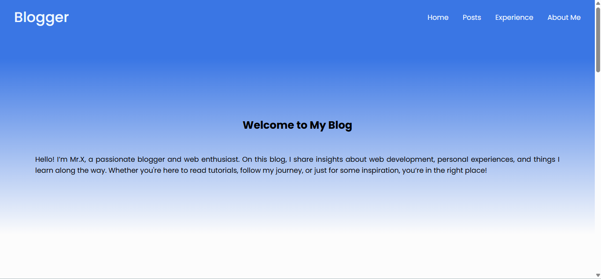
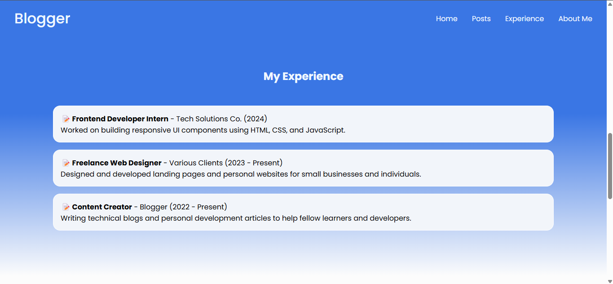
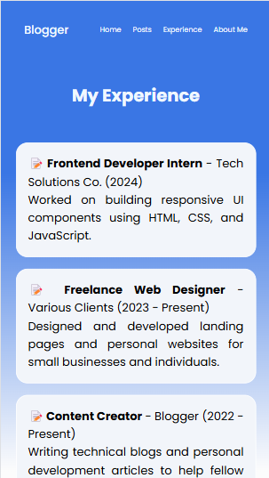

# Task 1: Static Webpage Layout

### 🎯Objective :

- Create a single-page responsive website using semantic HTML5 elements and CSS. The project showcases a simple structure for a personal or blog-style layout with proper use of `<header>`, `<nav>`, `<main>`, and `<footer>` tags.
.


###  🛠️ TechStack :

- HTML5
- CSS

### 💡 Features :

- Semantic HTML structure
- Responsive design with media queries
- Modern and clean layout
- Smooth adjustments across screen sizes

### 🖼️ Screenshots

#### Desktop View





#### Mobile View





### 🚀 To Run :

```
    git clone https://github.com/PrashanthSai-K/HTML-CSS.git

    cd task1
```
- Now open the index.html file in any browser

