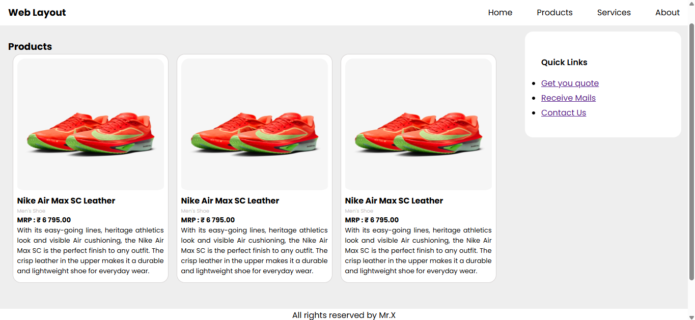
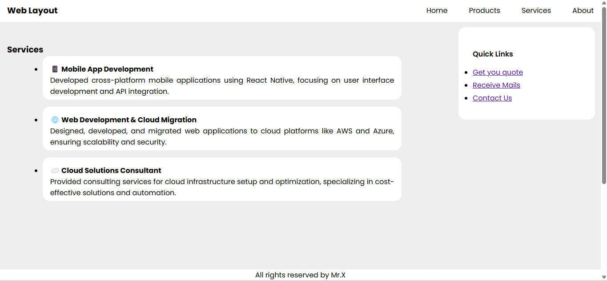
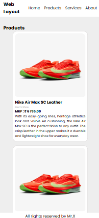

# Task 10: Interactive Multi-Page Website Simulator (CSS Only)
### 🎯Objective :

- Build a fully interactive, multi-section website that simulates traditional multi-page navigation using only HTML and CSS—no JavaScript!


###  🛠️ TechStack :

- HTML5
- CSS3
- CSS Grid & Flexbox
- Media Queries
- CSS Transitions

### 💡 Features :

- Multi-page simulation using `:checked` pseudo-class
- Smooth page transitions with fade or slide effects
- Fully responsive design using CSS Grid and Flexbox
- An accessible and mobile-friendly navigation menu
- Responsive design that dynamically reorders and adjusts layout based on screen size

### 🖼️ Screenshots

### 💻 Desktop View





### 📱 Mobile View




### 🚀 To Run :

```
    git clone https://github.com/PrashanthSai-K/HTML-CSS.git

    cd task10
```
- Now open the index.html file in any browser
