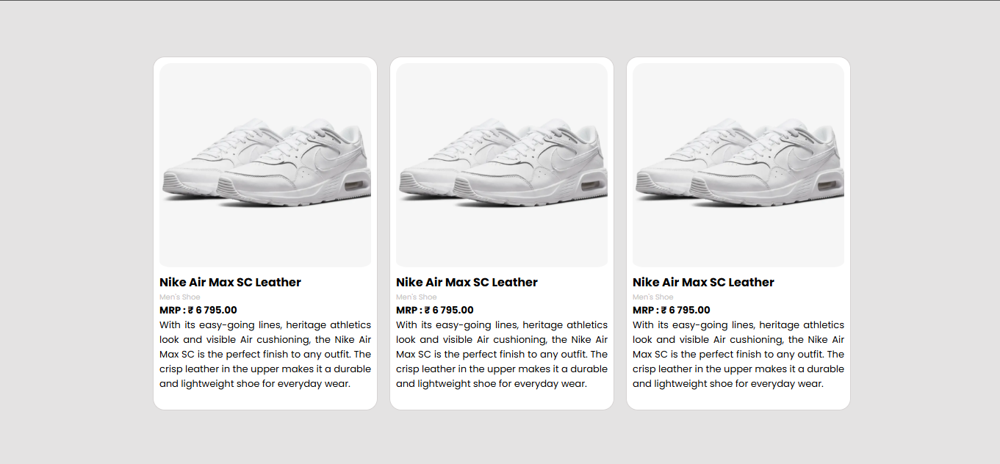
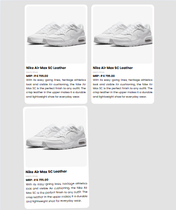
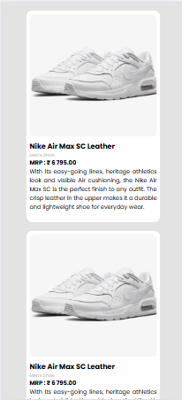

# Task 3: Responsive Grid Layout

### 🎯Objective :

- Build a responsive grid layout using CSS Grid that displays multiple items, with a layout that adapts gracefully from desktop to mobile screens.


###  🛠️ TechStack :

- HTML5
- CSS3

### 💡 Features :

- Responsive grid component
    - 3 column layout on desktop screens
    - 2 column layout on tab screens
    - 1 column layout on mobile screens
- Smooth hover effects
- Smooth responsiveness using media queries
- Smooth adjustments across screen sizes using media queries

### 🖼️ Screenshots









### 🚀 To Run :

```
    git clone https://github.com/PrashanthSai-K/HTML-CSS.git

    cd task3
```
- Now open the index.html file in any browser

