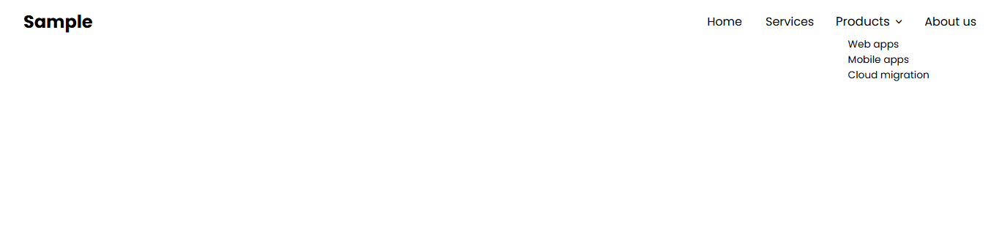

# Task 4: Pure CSS Dropdown Menu

### 🎯Objective :

- Create a responsive navigation bar with a dropdown submenu using only HTML and CSS. The dropdown should appear smoothly on hover, without any JavaScript.


###  🛠️ TechStack :

- HTML5
- CSS3
- CSS pseudo-classes like `:hover` and `:focus`

### 💡 Features :

- Pure CSS implementation
- Navigation bar with main menu items and a dropdown submenu
- Smooth reveal effect using transitions and `:hover`
- Supports both desktop and mobile layouts (responsive design)

### 🖼️ Screenshots





### 🚀 To Run :

```
    git clone https://github.com/PrashanthSai-K/HTML-CSS.git

    cd task4
```
- Now open the index.html file in any browser

