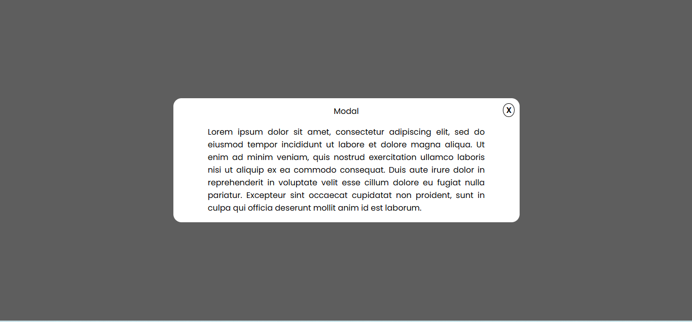
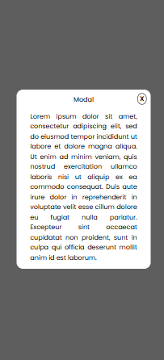

# Task 5: Modal Popup Using the `:target` or Checkbox Hack


### 🎯Objective :

- Create a modal (popup window) that opens and closes without using JavaScript by leveraging pure CSS techniques such as the `:target` or `:checked` pseudo-class.


###  🛠️ TechStack :

- HTML5
- CSS3
- CSS pseudo-classes like `:checked`

### 💡 Features :

- Fully functional modal window using only HTML and CSS
- Modal funcionality has been done with the Checkbox hack (`input[type="checkbox"]:checked`)
- Smooth transition effects on open/close
- Centered modal with overlay backdrop
- Responsive design: works on both desktop and mobile screens

### 🖼️ Screenshots








### 🚀 To Run :

```
    git clone https://github.com/PrashanthSai-K/HTML-CSS.git

    cd task5
```
- Now open the index.html file in any browser

