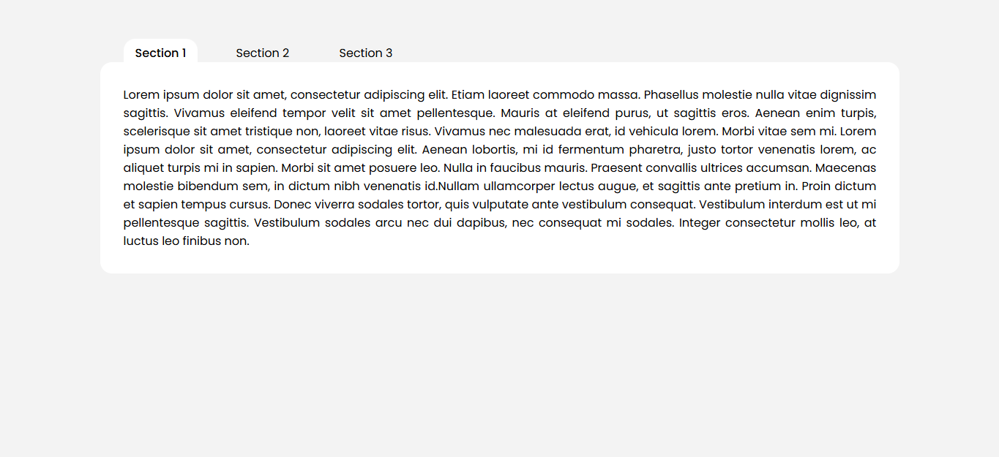
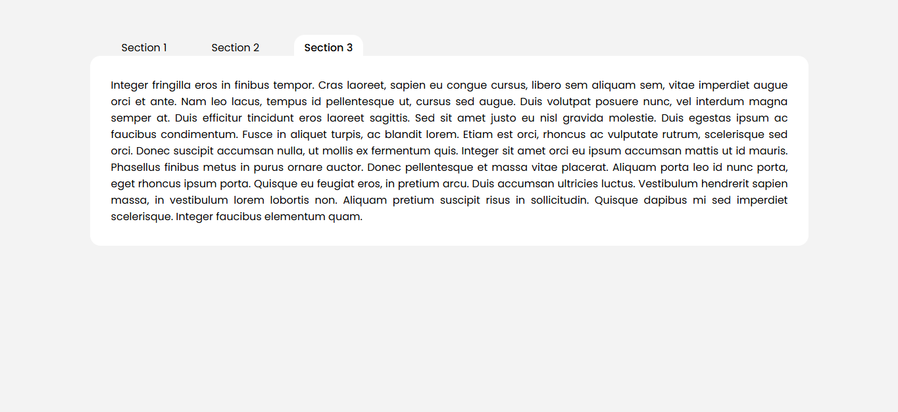
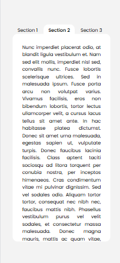
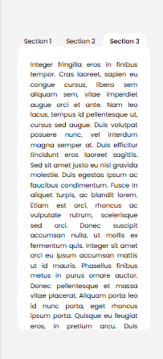

# Task 6: Tabbed Content Interface (CSS-only)


### 🎯Objective :

- Create a fully functional tabbed interface using only HTML and CSS, without JavaScript. Clicking on a tab reveals different content sections with smooth transitions.


###  🛠️ TechStack :

- HTML5
- CSS3
- CSS pseudo-classes like `:checked`

### 💡 Features :

- Fully functional tabbed interface using only HTML and CSS Radio buttons
- Hidden input elements (`radio` or `checkbox`) to control active tabs
- Tabbed interface funcionality has been done with the Radio hack (`input[type="radio"]:checked`)
- Smooth transition effects on tab switch
- Responsive design: works on both desktop and mobile screens

### 🖼️ Screenshots










### 🚀 To Run :

```
    git clone https://github.com/PrashanthSai-K/HTML-CSS.git

    cd task6
```
- Now open the index.html file in any browser

