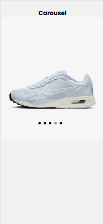

# Task 7: Pure CSS Carousel / Slider


### 🎯Objective :

- Create an image carousel/slider using only HTML and CSS that supports both automatic and manual slide navigation without JavaScript.


###  🛠️ TechStack :

- HTML5
- CSS3
- CSS pseudo-classes like `:checked`
- CSS Animations `@keyframes`

### 💡 Features :

- Fully functional image carousel without any JavaScript
- Automatic sliding using CSS `@keyframes`
- Manual controls using radio buttons (`:checked`)
- Navigation dots for manual selection
- Smooth sliding transitions between slides
- Responsive design: works on both desktop and mobile screens

### 🖼️ Screenshots





### 🚀 To Run :

```
    git clone https://github.com/PrashanthSai-K/HTML-CSS.git

    cd task7
```
- Now open the index.html file in any browser

