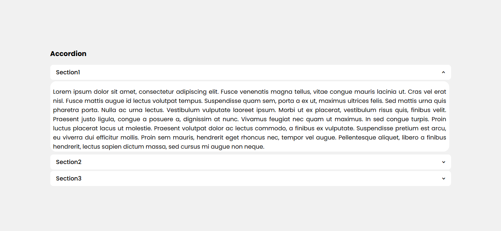
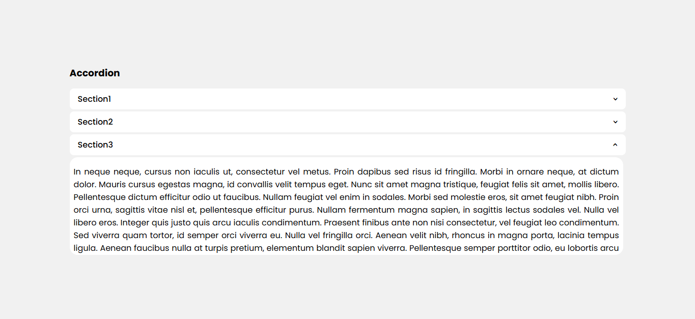
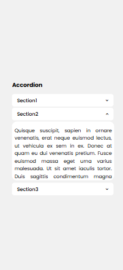
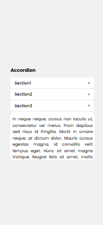

# Task 8: Pure CSS Accordion Component


### 🎯Objective :

- Create an interactive accordion using only HTML and CSS, where sections expand and collapse on click—without JavaScript!


###  🛠️ TechStack :

- HTML5
- CSS3
- CSS pseudo-classes like `:checked`

### 💡 Features :

- Expandable/collapsible content sections using the checkbox hack.
- Smooth CSS transitions for opening and closing animations.
- Supports single-open behavior(accordion-style)
- Responsive and accessible design
- Responsive design: works on both desktop and mobile screens

### 🖼️ Screenshots










### 🚀 To Run :

```
    git clone https://github.com/PrashanthSai-K/HTML-CSS.git

    cd task8
```
- Now open the index.html file in any browser
