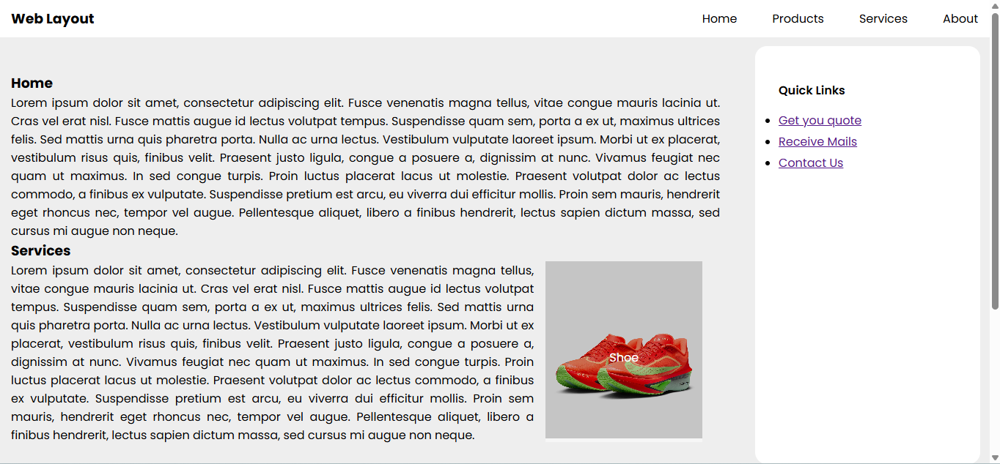
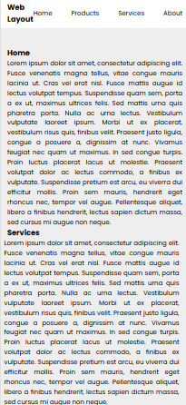
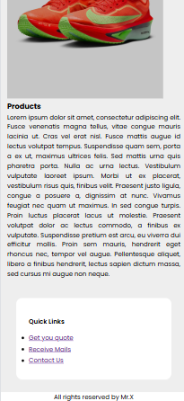

# Task 9: Complex Responsive Layout with Grid and Flexbox

### 🎯Objective :

- Design a sophisticated and responsive webpage layout by combining **CSS Grid** for the main structure and **Flexbox** for internal element alignment, while including advanced features like overlapping elements and sticky positioning.


###  🛠️ TechStack :

- HTML5
- CSS3
- CSS Grid
- CSS Flexbox
- Media Queries

### 💡 Features :

- CSS Grid for the main page layout (header, sidebar, content, footer)
- Flexbox to align and space content inside each section or component
- Overlapping elements using `position: absolute` and `z-index`
- Sticky header & Fixed sidebar that stays fixed during scrolling
- Responsive design that dynamically reorders and adjusts layout based on screen size

### 🖼️ Screenshots

### 💻 Desktop View



### 📱 Mobile View






### 🚀 To Run :

```
    git clone https://github.com/PrashanthSai-K/HTML-CSS.git

    cd task9
```
- Now open the index.html file in any browser
